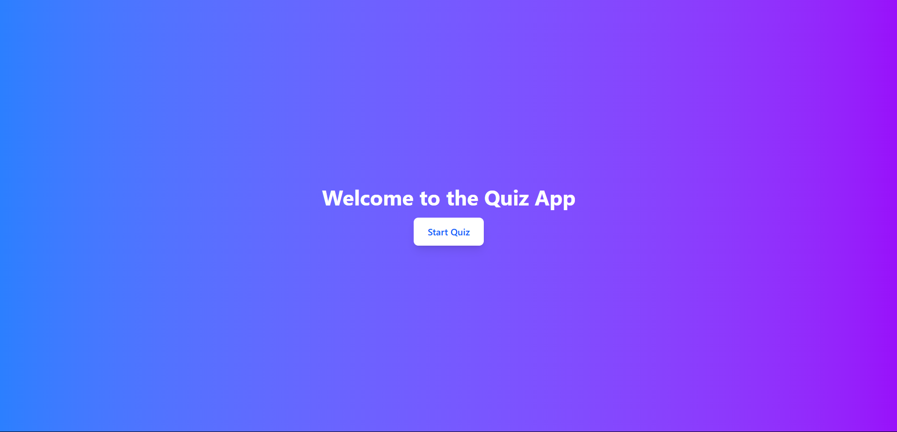
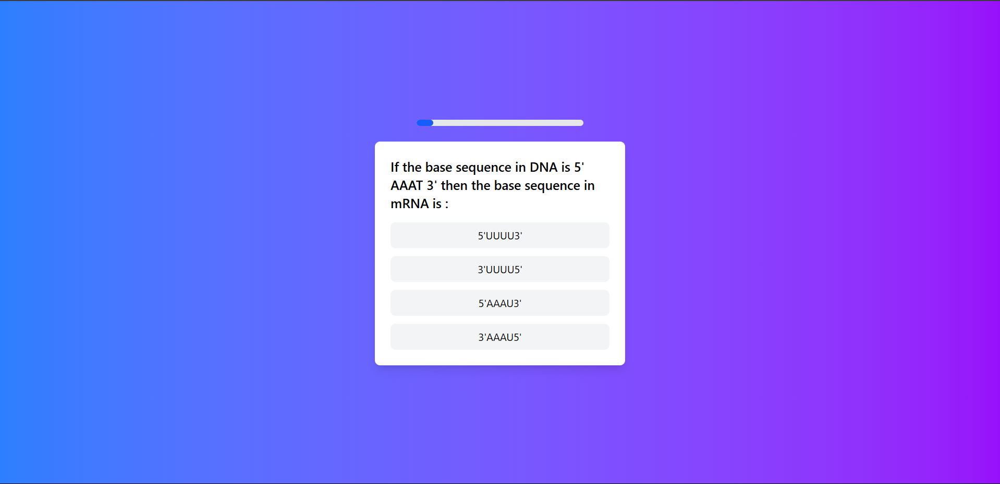

# Quiz App with Gamification

A web-based quiz application with gamification features, built using **React**, **TypeScript**, and **TailwindCSS**. The app fetches quiz data from a predefined JSON file (due to CORS issues with the API) and provides a professional-grade quiz experience with visual feedback for correct/incorrect answers.

---

## **Features**
- **Start Quiz**: Begin the quiz with a single click.
- **Visual Feedback**: Correct answers turn **green**, and incorrect answers turn **red** with the correct answer highlighted in **green**.
- **Progress Bar**: Tracks the user's progress through the quiz.
- **Quiz Summary**: Displays the final score and allows the user to restart the quiz.

---

## **Screenshots**

### Screenshot 1: Quiz Interface


### Screenshot 2: Quiz Summary


---

## **Video Walkthrough**
Watch the app in action: [Quiz App Video Walkthrough](https://drive.google.com/file/d/1RGjUWHBqyFCDiosyM4pEDqi0j1afWLX6/view?usp=drive_link)

---

## **Implementation Steps**

### 1. **Setup the Project**
- Clone the repository:
  ```bash
  git clone https://github.com/your-username/quiz-app.git
  cd quiz-app

## **Project Structure**
quiz-app/
├── public/
│   └── quizData.json
├── src/
│   ├── components/
│   │   ├── QuizCard.tsx
│   │   ├── QuizSummary.tsx
│   │   └── ProgressBar.tsx
│   ├── pages/
│   │   ├── Home.tsx
│   │   └── Quiz.tsx
│   ├── types/
│   │   └── quizTypes.ts
│   ├── utils/
│   │   └── api.ts
│   ├── App.tsx
│   └── index.tsx
├── pictures/
│   ├── screenshot01.png
│   ├── screenshot02.png
├── README.md
├── package.json
└── tailwind.config.js


The app is deployed using Vercel (or any other platform of your choice). You can access the live demo here: Quiz App Live Demo

## **License**
This project is licensed under the MIT License. See the LICENSE file for details
